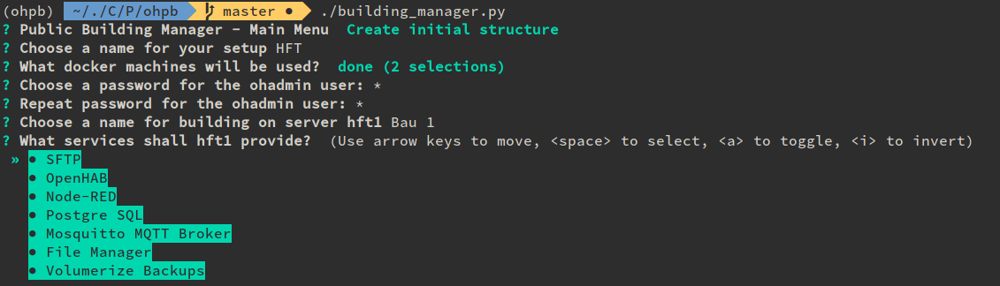
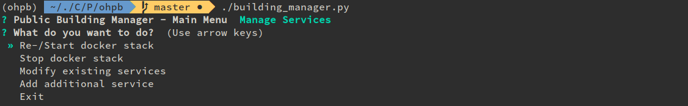
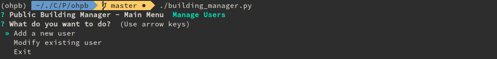
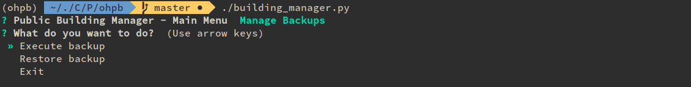
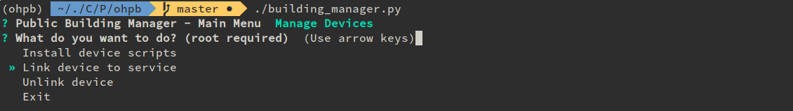

# openHAB Public Building Stack

This repository contains files describing an openHAB stack for a public institutions with multiple buildings.

An openHAB public building stack consists of a docker swarm setup that is build around a compose file and several configuration files for all needed services.

Heart of the stack is the **Building Manager Script** served as `building_manager.py` and a set of templates. This script provides commands to create and control a multi building setup. 


## Getting Started

Before working with the script it first needs to be loaded onto one of the desired machines to be used. This can easily be achieved by cloning the script to the machine using git (`sudo apt install git` if it is missing):

```sh
git clone https://github.com/Dobli/openhab-pb-stack.git
```

This will create a local copy of the script in the current folder. Change to its directory:

```sh
cd openhab-pb-stack
```


#### Requirements

The building manager script has a few requirements for the system as well as for the python environment before being able to be executed.

**System:**

First of it needs a few system components, they essentially consist of Docker and Python:

```
docker
docker-compose
docker-machine
python3 (at least 3.6)
python3-pip
mosquitto (needed to for mosquitto password generation)
ssh-keygen
```

On a Ubuntu system most of these can be installed following these commands:

```bash
sudo apt install mosquitto, python3-pip		# Needed to use mosquitto_passwd
sudo systemctl stop mosquitto				# Stop Mosquitto service
sudo systemctl disable mosquitto			# Disable Mosquitto service
```

To install docker it is **not** recommended to use the versions in the Ubuntu repository. Instead the official Docker install instructions should be used to install [Docker](https://docs.docker.com/install/linux/docker-ce/ubuntu/), [Docker Compose](https://docs.docker.com/compose/install/) and [Docker Machine](https://docs.docker.com/machine/install-machine/).

While the other requirements are only necessary on a single machine to work with the script, Docker needs to be available on all machines.

**Python:**

Beside the system requirements the following python libraries are needed too:

```sh
docker			# Docker client library
questionary		# Prompt library
ruamel.yaml		# Yaml library that preserves structure
bcrypt			# generate bcrypt hashes
pip-tools		# manage requirements (Optional)
```

Again on an Ubuntu system the following command can be used to install them for the current user (you need to be in the cloned folder):

```
pip3 install --user -r requirements.txt
```

All python requirements are managed using `pip-tool` in the `requirements.in` file. The command `pip-compile`  generates a `requirements.txt` file that  can be used with with `pip ` to install all needed python dependencies. 

Updating the `requirements.txt` file can be done using `pip-compile` again. In an virtual environment `pip-sync` can be used instead of pip install to install needed packages.

### Preparation

After installing the requirements it is necessary to connect all instances intended to be used with docker-machine. Docker-machine allows to manage multiple machines running the docker daemon.

[These instructions](https://docs.docker.com/machine/drivers/generic/) explain how to add a machine to docker-machine.

**NOTE:** Following example assumes the machines have the hostnames *building1* (IP: 192.168.1.10) and *building2* (IP: 192.168.1.20) both have a user called *pbuser*. These values need to be **adapted** to your setup.

Following steps need to be executed for every machine that should run the script to configure:

1. Generate keys on the master node for ssh access

   ```sh
   ssh-keygen -b 4096 		# will be saved to ./ssh/id_rsa
   ```

2. Copy the key from the main machine to all nodes (even the master itself):

   ```sh
   ssh-copy-id pbuser@building1
   ssh-copy-id pbuser@building2
   ```

   This allows to access the machines using ssh without a password.

3. Docker-machine needs the users on **each node** to be able to use sudo without a password, to enable it for our example *pbuser* add the following line to the `/etc/sudoers`:

   ```sh
   pbuser ALL=(ALL) NOPASSWD: ALL
   ```

   To add this line with a single command to the file execute the following (**on each node**):

   ```sh
   echo "pbuser ALL=(ALL) NOPASSWD: ALL" | sudo tee -a /etc/sudoers
   ```

4. Finally add all nodes to docker-machine on each machine that shall run the script:

   ```sh
   docker-machine create --driver generic --generic-ip-address=192.168.1.10 --generic-ssh-key ~/.ssh/id_rsa --generic-ssh-user pbuser building1		# Building 1
   docker-machine create --driver generic --generic-ip-address=192.168.1.20 --generic-ssh-key ~/.ssh/id_rsa --generic-ssh-user pbuser building2		# Building 2
   ```

### Run it!

When requirements are installed and docker-machine preparations are finished the script can be started by calling it.

```sh
cd openhab-pb-stack		# Change to script directory
./building-manager.py	# Execute script add --help for further options
```

This will open the script in interactive mode. It shows a menu with various options to choose from described below.


## What can it do?

### Initial Setup

When the script is started for the first time the only option is to create an initial setup. This will ask multiple questions about the setup, e.g. which machine nodes will be used, what services they shall provide and what the administrative password should be. It then generates all needed files and places them in the `custom_configs/` folder. 



### Start and stop the stack

After successful initial execution the stack can be started and stoped either by rerunning the application and using the service menu or by executing  the following commands from the repo directory:

```sh
docker stack deploy -c custom_configs/docker-stack.yml ohpb		# Start stack
docker stack rm ohpb											# Stop stack
```

### Manage Services

As already mentioned the application offers the option to start and stop services, this is done by executing the above commands. In addition it allows to adjust, create and remove services by adjusting the stack file.



### Manage Users

A basic user management is also possible through the application. It allows to create new users (for the access to the web applications only), as well as change passwords and remove them.



### Manage Backups

A further addition is a backup menu. It allows to execute backups by executing the necessary volumerize commands. It also allows to restore files from a backup to the correct volumes.



When a backup exists the menu also offers to move a building (e.g. usefull when changing the machine after a system error). In this case the applications adjust the labels of the nodes and automatically restores the building on the new machine.

By default backups are automatically created at 04:00AM. This and the detailed backup settings can be changed, see the [volumerize documentation](https://github.com/blacklabelops/volumerize) for details.

### Manage Devices

An automation setup needs to access several different devices to be able to communicate with sensors and actors (e.g. an USB Z-Wave modem). These are by default not accessible to docker containers, docker swarm also does not provide a default way to grant access to them. Docker uses cgroups to manage device access though. This enables us to grant the correct cgroup permissions when a container launches. The script offers a menu entry to install the necessary files and rules on any connected node. A second entry then allows to setup links between containers and devices. 



To execute these steps manually it is also possible to execute the `install_usb_support.sh` script manually. To link and unlink devices on a specific node it is only necessary to create/remove a corresponding systemd service: 

```sh
# Create and start link service for openhab locally
sudo systemctl enable --now swarm-device@zwave_stick\\x20openhab.service
# Remove and stop systemd service for openhab locally
sudo systemctl disable --now swarm-device@zwave_stick\\x20openhab.service
```

## How it works

Following parts describe a little more in detail how the script works and how parts may be executed manually.

### Configuration file generation

The generated swarm stack consists of multiple configuration files that need to be available and will be used by the docker containers. The *Public Building Manager* script generates these for convenience. In addition they are documented here, sorted by application/folder, to understand what they do.

**docker-stack.yml**

- Main docker stack file that contains all services
- Generated by copying and modifying snippets from two templates
  - *docker-skeleton.yml*: contains the base structure of the compose file
  - *docker-templates.yml*: contains templates for service entires

**mosquitto**

- *mosquitto.conf*: basic configuration of mosquitto
  - copied from template folder
  - disables anonymous access to the MQTT server
  - enables usage of a password file
- *mosquitto_passwords*: List of users/passwords that gain access to mosquitto
  - generated with `mosquitto_passwd`
  - Uses custom SHA512 crypt

**nodered**

- *nodered_settings.js*: basic node red settings
  - copied from template folder

**ssh**

- *sshd_config*: basic ssh config
  - copied from template folder
- *sftp_users.conf*: file containing users for sftp container
  - generated, grants access to configuration files over SFTP
  - usually  `makepasswd` is used to generate MD5 hashed passwords
  - script uses pythons `crypt` to generate them
    - as it relies on the Linux password system we can even use stronger hashes like SHA512
- *known_hosts*: make backup (volumerize) hosts know internal ssh servers
  - generated using ssh-keygen
- *id_rsa/id_rsa.pub*: key pair for passwordless ssh between containers
  - generated using ssh-keygen
- *ssh_host_x_key*: hostkey for ssh, X is cryptosystem
  - generated using ssh-keygen

**postgres**

- *passwd*: contains the initial password for the database administrator
  - MD5 hash generated in python
- *user*: contains the initial user name for the database administrator

**traefik**

- *traefik.toml*: basic traefik configuration
  - copied from template folder 
  - entryPoints.http.auth.basic contains usersFile that describes the path to a htpasswd file
- *traefik_users*: htpasswd style file that contains users and hashed passwords
  - file and contained hash are generated using the `bcrypt` hash library in python

**pb-framr**

- *logo.svg*: the logo used in the frame menu, may be replaced by a custom one
  - copied from the template folder
- *pages.json*: configures the menu entries in the frame menu
  - generated by the script based on choosen services

**volumerize**

- *backup_config_X.json*: backup/volumerize config for each building, X is replaced by building name
  - contains the backup targets/restore sources for volumerize


## Development

### Setup

To develop the application a similar setup is needed as described in the production instructions above.

It is recommended to use a `virtualenv` python environment though. This can be either setup for the project in the used IDE or directly on the system using solutions like [virtualenvwrapper](https://virtualenvwrapper.readthedocs.io/en/latest/). The `virtualenv` keeps the python environment of the project separate of the system. Ensure it is a python 3 environment (at least python 3.6)

When the `virtualenv` is activated execute the following commands from the root directory of the repository to ensure all python dependencies are installed:

```sh
pip install pip-tools		# installs tools for dependency management
pip-sync					# ensures virtualenv matches requirements.txt
```

When additional requirements are needed they can be added to the `requirements.in` file and installed to the `virtualenv` with following commands:

```sh
pip-compile					# compile requirements.txt from requirements.in
pip-sync					# ensures virtualenv matches requirements
```

**Test environment**

To be able to properly try and test the script separate docker machines are needed. An obvious way to achieve this locally is to use a set of VMs. These can be easily created using [docker machine](https://docs.docker.com/machine/install-machine/). When installed on the development machine it is enough to execute:

```sh
docker-machine create --driver virtualbox building1	# Creates VM with name building1
docker-machine create --driver virtualbox building2	# Creates VM with name building2
```

This will create a VM install an OS that only contains docker inside and start it. It can then be managed with following commands:

```sh
docker-machine start <machine-name>		# Start the VM
docker-machine stop <machine-name>		# Stop the VM
```

What makes handling easy is, that all docker commands can be executed as if they were executed in one of the VMs (e.g. `docker ps`). To achieve this the docker environment can be set with the following command:

```sh
eval $(docker-machine env <machine-name>)		# Set docker to a machine
```


### Manual Swarm environment

The generated stack needs a docker swarm that will be used to execute it. On initial run the script will ask to generate it for the choosen machines. The swarm can also be created manually.

To initialize swarm mode on the first machine switch the environment to the first machine (see above) and execute: 

```sh
docker swarm init --advertise-addr <MANAGER-IP> # Replace <MANAGER-IP> IP by the ip of the machine (check with docker-machine ls)
```

This will setup a swarm environment and print a command to be used on other machines to join this swarm similar to this:

```sh
docker swarm join --token SWMTKN-1-44lk56nj5h6jk4h56yz0fb0xx14ie39trti4wxv-8vxv8rssmk743ojnwachk4h567c <MANAGER-IP>:2377
```

This than has to be executed on the second machine (again switch environment). The result can be checked by running `docker node ls` on the first machine again.

#### Add building labels

A manually created swarm is not able to launch a stack yet or rather will not start applications. It is first necessary to assign building roles to hosts first. This is solved by labels assigned to the nodes. By default they match the machines node name so e.g. labels could be `building1` and`building2`  to assign these run the following commands on the first machine:

```sh
docker node update --label-add building=building1 <NAME_OF_HOST_1>
docker node update --label-add building=building2 <NAME_OF_HOST_2>
```
Docker swarm should pick up the changes automatically and start the stack on each machine if it was already deployed.

### Adding own services

As the script does not save any information itself, it is possible to add own services by manually modifying the generated stack file in `custom_configs/docker-stack.yml`, just be aware to set a deployment label to ensure it will run on the intended building, take existing services as a reference.

### Extending Device Support

As of now the device link helper only supports the *Aeotec Z-Stick Gen5* Z-Wave Stick. To add support for additional devices it is necessary to create a udev rule for each. This ensures the device can be uniquely identified later during linking with docker containers. 

For this we first need to get the vendor and product ID of our new device. For devices connected via USB they can be obtained by executing `lsusb` before and after connecting the device. The new entry is the just connected device the IDs can be found after the ID keyword in the format `vvvv:pppp` the first number (`vvvv`) is the vendor ID the second (`pppp`) is the product ID.

After obtaining the IDs, add a new rule to the `./tempolate_configs/docker-devices.rules` file. It should look like this:

```sh
# Serial USB device notice singular SUBSYSTEM
SUBSYSTEM=="tty", ATTRS{idVendor}=="vvvv", ATTRS{idProduct}=="pppp", GROUP="dialout", MODE="0666", SYMLINK+="my_serial"
# Real USB device notice plural SUBSYSTEMS
SUBSYSTEMS=="usb", ATTRS{idVendor}=="vvvv", ATTRS{idProduct}=="pppp", GROUP="dialout", MODE="0666", SYMLINK+="my_usb"
```

**Notice:** Serial devices connected through USB (like ZigBee or Z-Wave modems) still need an `tty` entry. 

To use this new rule simply rerun the installation of the device scripts as explained above. After replugging the device it will now always be available by the name defined with `SYMLINK+=`, e.g. `/dev/my_serial`.

From now on the device can be linked manually already by creating a systemd entry manually using its device name. To make the script aware of the new device (and have an entry in the menu) simply extend the constant `USB_DEVICES` in the `building_manager.py` by a new entry using the device name as the value.

Also note openHAB manages the serial devices it can access using a whitelist (see [here](https://www.openhab.org/addons/bindings/serial1/) for details). So when adding a new device extend this whitelist using the EXTRA_JAVA_OPTS entry of openHAB in the compose file (and also in the template to have it available on new installs).
